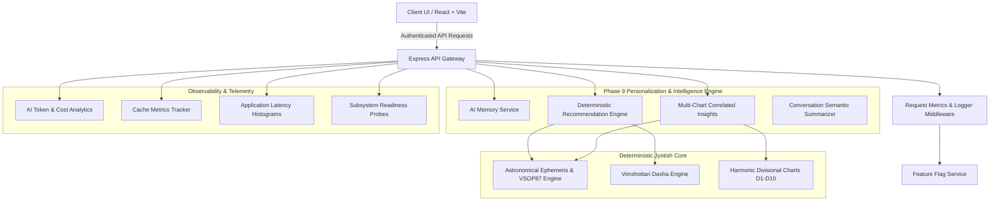

# Phase 9: Intelligence, Personalization, Performance & Production Observability Architecture

## Executive Overview
Phase 9 expands the Astrologer platform into a production-grade, highly observable, personalized Vedic Astrology SaaS. It introduces an intelligent memory layer, multi-chart astrological correlation, deterministic action recommendations, granular AI cost analytics, cache hit ratio monitoring, structured JSON logging with automated secret redaction, and server-authoritative feature flags.

---

## Core Pillars of Phase 9

---

## Architectural Principles & Strict Guarantees

1. **Deterministic Authority**: Astronomical and astrological calculations remain strictly deterministic. Planetary longitudes, divisional house cusps, and Dasha trees are computed mathematically. AI is never used to fabricate or hallucinate astrological data.
2. **Tenant Isolation**: Every memory item, profile, recommendation dismissal, chat session, and analytics event is bound to `userId` and verified at the database access layer.
3. **Data Sanitization**: AI memory automatically rejects PII, credit card patterns, JWTs, and API credentials.
4. **Resilient Caching**: In-memory and distributed cache tiers track cache hit/miss rates, memory footprint, and evictions with real-time admin telemetry.
5. **Observability Without Secret Leakage**: All logs redact authorization tokens, passwords, database URIs, and webhook secrets.
